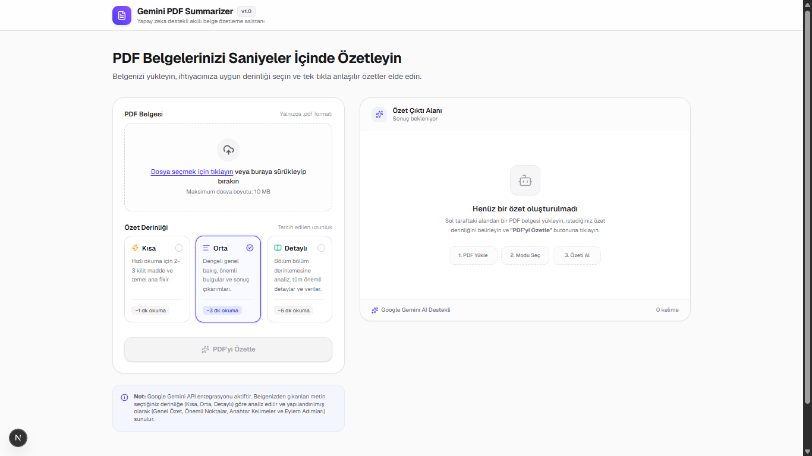

# Gemini PDF Summarizer

Gemini PDF Summarizer, PDF belgelerini analiz ederek kısa, orta veya detaylı yapılandırılmış özetler üreten yapay zekâ destekli bir web uygulamasıdır. Next.js, TypeScript ve Google Gemini API kullanır.



---

## 🚀 Özellikler

- **Modern PDF Yükleme:** Sürükle-bırak ve dosya seçici desteği ile kolay belge yükleme.
- **Server-Side PDF Metin Çıkarma:** Tarayıcıyı kasmadan, sunucu tarafında hızlı ve izole metin ayrıştırma (`unpdf`).
- **10 MB Dosya Sınırı:** Hem istemci hem de sunucu tarafında 10 MB dosya boyutu doğrulaması.
- **Esnek Özet Derinliği:** İhtiyaca göre seçilebilir **Kısa**, **Orta** veya **Detaylı** özet modları.
- **Yapılandırılmış JSON Sonuçları:**
  - **Genel Özet:** Belgenin ana temasını yansıtan akıcı metin.
  - **Önemli Noktalar:** Numaralandırılmış kilit bulgular ve çıkarımlar.
  - **Anahtar Kelimeler:** Belgeyi niteleyen modern rozet/çip etiketleri.
  - **Eylem Adımları:** Belgede somut görev veya tavsiye varsa otomatik listeleme (yoksa gizlenir).
- **Uzun Belge Desteği (Chunking):** 12.000 karakteri aşan belgeler için paragraf duyarlı map-reduce sentezleme.
- **Dayanıklı Retry Mekanizması:** 503, 429, 500, 502, 504 ve geçici network kesintilerinde otomatik exponential backoff (2s, 4s, 8s).
- **Kalıcı Hata Koruması:** 400, 401, 403, 404 gibi kalıcı hatalarda gereksiz bekleme yapmadan anında yanıt.
- **Tek Tıkla Kopyalama:** Üretilen raporu tüm başlık ve bölümleriyle Markdown formatında panoya kopyalama.
- **Belge İstatistikleri:** İşlenen belgenin sayfa sayısı, karakter sayısı, özet modu ve üretilen kelime adedini tek satırda gösterme.
- **Maksimum Güvenlik:** `GEMINI_API_KEY` yalnızca sunucuda barınır; istemciye, tarayıcıya veya loglara sızdırılmaz.
- **Duyarlı ve Zarif Tasarım:** Mobil, tablet ve masaüstü uyumlu, temiz ve profesyonel SaaS arayüzü.
- **%100 Türkçe Deneyim:** Kullanıcıya yönelik tüm butonlar, uyarılar ve durum bildirimleri eksiksiz Türkçeleştirilmiştir.

---

## 🛠 Kullanılan Teknolojiler

Projede kullanılan başlıca kütüphaneler ve `package.json` içindeki güncel sürümleri:

| Teknoloji | Sürüm | Kullanım Amacı |
| :--- | :--- | :--- |
| **[Next.js](https://nextjs.org/)** | `16.3.4` | Full-stack React framework (App Router & Turbopack) |
| **[React](https://react.dev/)** | `19.2.8` | Kullanıcı arayüzü kütüphanesi |
| **[React DOM](https://react.dev/)** | `19.2.8` | React DOM bağlayıcısı |
| **[TypeScript](https://www.typescriptlang.org/)** | `^5` | Tip güvenliği ve ölçeklenebilir kod mimarisi |
| **[Tailwind CSS](https://tailwindcss.com/)** | `^4` | Yardımcı sınıf tabanlı modern stil kütüphanesi |
| **[@google/genai](https://www.npmjs.com/package/@google/genai)** | `^2.21.0` | Resmi Google Gemini SDK |
| **[unpdf](https://unjs.io/packages/unpdf)** | `^1.8.1` | Native canvas bağımlılığı olmayan modern PDF ayrıştırıcı |
| **[Lucide React](https://lucide.dev/)** | `^1.43.0` | Arayüz ikon seti |

---

## 📐 Uygulama Mimarisi

```text
PDF Belgesi
     ↓
PDF Yükleme (components/FileUpload.tsx)
     ↓
Server-Side Metin Çıkarma (app/api/extract-pdf/route.ts)
     ↓
unpdf (WASM / Node.js Runtime)
     ↓
Metin Doğrulama & Temizleme (Boyut, format, boş içerik kontrolü)
     ↓
Chunking Sistemi (lib/chunking.ts - Metin > 12.000 karakter ise)
     ↓
Gemini API Çağrısı (lib/gemini.ts - withRetry & JSON Schema)
     ↓
Yapılandırılmış JSON Yanıtı (summary, keyPoints, keywords, actionItems)
     ↓
Sonuç Arayüzü (components/SummaryResult.tsx)
```

### Uzun Belgelerde Map-Reduce Benzeri Özetleme Mantığı
- **Kısa/Orta Belgeler (≤ 12.000 Karakter):** Tek bir Gemini API isteği ile doğrudan nihai JSON şemasında özetlenir. Gereksiz API maliyetinden ve gecikmeden kaçınılır.
- **Uzun Belgeler (> 12.000 Karakter):**
  1. **Bölme (Split):** Metin, paragraf ve cümle bütünlüğü gözetilerek ~10.000 karakterlik parçalara (`chunkSize`) ve 500 karakterlik örtüşmeye (`overlap`) ayrılır.
  2. **Map (Ara Özet):** Her parça bağımsız olarak özetlenerek kilit bulgular çıkarılır. Her bir parça kendi `withRetry` döngüsüyle korunur.
  3. **Reduce (Sentez):** Ara özetler birleştirilerek tek bir final çağrısıyla tüm dokümanı temsil eden tutarlı ve yapılandırılmış özet üretilir.

---

## 📋 Gemini JSON Çıktı Yapısı

Gemini modeline iletilen `responseSchema` sayesinde model çıktısı kesin olarak aşağıdaki şemada döner:

```json
{
  "summary": "Belgenin genel özeti",
  "keyPoints": [
    "Kilit bulgu veya önemli çıkarım 1",
    "Kilit bulgu veya önemli çıkarım 2"
  ],
  "keywords": [
    "yapay-zeka",
    "pdf-analizi",
    "veri-yonetimi"
  ],
  "actionItems": [
    "Öncelikli aksiyon veya tavsiye 1"
  ]
}
```

> **Not:** Dokümanda herhangi bir eylem adımı bulunmuyorsa `actionItems` alanı boş bir dizi (`[]`) olarak döner ve arayüzde boş kart oluşturulmaz.

---

## ⚙️ Kurulum

### 1. Depoyu Klonlayın
```bash
git clone https://github.com/kullanici-adi/gemini-pdf-summarizer.git
cd gemini-pdf-summarizer
```

### 2. Bağımlılıkları Yükleyin
```bash
npm install
```

### 3. Ortam Değişkenlerini Tanımlayın
Proje kök dizinindeki `.env.example` dosyasını referans alarak `.env.local` dosyasını oluşturun:

```bash
cp .env.example .env.local
```

`.env.local` içeriğini kendi API anahtarınızla güncelleyin:
```env
GEMINI_API_KEY=your_api_key_here
GEMINI_MODEL=gemini-3.6-flash
```

---

## 🔑 Gemini API Key Kurulumu

1. [Google AI Studio](https://aistudio.google.com/) adresine gidin ve Google hesabınızla giriş yapın.
2. **"Get API key"** butonuna tıklayarak yeni bir API anahtarı oluşturun.
3. Kopyaladığınız anahtarı `.env.local` dosyasındaki `GEMINI_API_KEY` alanına yapıştırın.
4. `.env.local` dosyası `.gitignore` kapsamındadır; anahtarınız hiçbir zaman Git geçmişine eklenmez.

---

## 💻 Çalıştırma

### Geliştirme Modu (Development)
```bash
npm run dev
```
Tarayıcınızdan `http://localhost:3000` adresine giderek uygulamayı görüntüleyebilirsiniz.

### Canlı Mod (Production Build)
```bash
npm run build
npm start
```

---

## 📄 PDF Metin Çıkarma Mimarisi

- Metin çıkarma işlemi `app/api/extract-pdf/route.ts` Route Handler üzerinden yürütülür.
- İstemci, seçilen PDF dosyasını `multipart/form-data` formatında bu endpoint'e gönderir.
- Sunucu tarafında `unpdf` kütüphanesi kullanılarak sayfa ve metin ayrıştırması yapılır:
  - Dosya boyutu 10 MB'ı aşıyorsa `400 Bad Request` yanıtı verilir.
  - PDF geçerli değilse veya metin içermeyen taranmış görselden ibaretse kullanıcıya anlamlı bir Türkçe hata mesajı döner.
  - Çıkarılan metin ve istatistikler istemciye JSON formatında aktarılır:
    ```json
    {
      "success": true,
      "fileName": "dokuman.pdf",
      "pageCount": 11,
      "characterCount": 21572,
      "text": "..."
    }
    ```

---

## 🔁 Dayanıklı Retry Mekanizması

Ağ kesintileri veya servis kotaları nedeniyle oluşabilecek hataları yönetmek için `lib/gemini.ts` dosyasında özel bir `withRetry` mekanizması çalışır:

- **Retry Kapsamındaki Hatalar:** `503 UNAVAILABLE`, `429 RESOURCE_EXHAUSTED`, `500`, `502`, `504`, `fetch failed`, `ETIMEDOUT`, `ECONNRESET` ve soket kesintileri.
- **Exponential Backoff Bekleme Süreleri:**
  - 1. Başarısız Deneme Sonrası: **2 saniye** (2.000 ms)
  - 2. Başarısız Deneme Sonrası: **4 saniye** (4.000 ms)
  - 3. Başarısız Deneme Sonrası: **8 saniye** (8.000 ms)
- **Deneme Sınırı:** En fazla **3 retry** (ilk çağrı ile birlikte toplam 4 deneme).
- **Kalıcı Hatalar (Retry Yapılmaz):** `400 Bad Request`, `401 Unauthorized`, `403 Forbidden`, `404 Not Found` ve eksik API key durumlarında anında çıkılır.
- **Kullanıcı Bilgilendirmesi:** Tüm denemelere rağmen servis yanıt vermezse kullanıcıya doğrudan şu mesaj gösterilir:
  > *"Gemini servisi şu anda yoğun. Lütfen birkaç dakika sonra tekrar deneyin."*

---

## 🔒 Güvenlik

- **Server-Side API Key:** `GEMINI_API_KEY` sadece sunucu ortamında (`process.env`) okunur. İstemci kodunda (React bundle) kesinlikle yer almaz.
- **Log Temizliği:** Hata loglarında veya konsol çıktılarında API anahtarı hiçbir şekilde yer almaz (`sanitizeErrorMessage`).
- **Git Güvenliği:** `.gitignore` dosyası `.env*` dosyalarını hariç tutar, yalnızca şablon olan `.env.example` dosyasının izlenmesine izin verir (`!.env.example`).

---

## ⚠️ Bilinen Sınırlamalar

- **Dosya Boyutu:** Yüklenebilecek maksimum PDF boyutu **10 MB** ile sınırlandırılmıştır.
- **Taranmış Belgeler (OCR):** Belge yalnızca görselden oluşuyorsa (taranmış sayfa veya fotoğraf) metin çıkarılamaz; metin katmanı içeren PDF'ler gereklidir.
- **Çok Uzun Belgeler:** 12.000 karakteri aşan belgelerde parçalama nedeniyle arka planda birden fazla Gemini isteği gerçekleştirilir.
- **Servis Yoğunluğu:** Google Gemini API kotaları veya yoğunluk dönemlerinde geçici gecikmeler yaşanabilir.

---

## 🗺️ Roadmap (Gelecek Planları)

- [ ] **OCR Desteği:** Taranmış ve metin içermeyen PDF'ler için entegre OCR (Optik Karakter Tanıma).
- [ ] **PDF ile Sohbet (Q&A):** Özetlenen doküman üzerinden yapay zekâ ile etkileşimli soru-cevap desteği.
- [ ] **Çoklu Belge Karşılaştırma:** Birden fazla PDF yükleyerek karşılaştırmalı analiz üretme.
- [ ] **Özet Geçmişi:** Kullanıcının daha önce ürettiği özetleri tarayıcıda saklama.
- [ ] **Kullanıcı Hesapları:** Firebase / Supabase tabanlı kullanıcı kayıt ve yetkilendirme sistemi.
- [ ] **Dışa Aktarma:** Özet sonuçlarını PDF veya DOCX dosyası olarak indirme.
- [ ] **Dil Seçimi:** Belge dili dışında farklı bir hedef dilde özet alabilme seçeneği.
- [ ] **Model Seçimi:** Arayüz üzerinden Gemini 1.5 Flash, 2.0 Flash veya Pro modelleri arasında geçiş yapabilme.

---

## 📁 Proje Klasör Yapısı

```text
gemini-pdf-summarizer/
├── app/
│   ├── api/
│   │   ├── extract-pdf/
│   │   │   └── route.ts         # Server-side PDF metin çıkarma API'si
│   │   └── summarize/
│   │       └── route.ts         # Gemini API özetleme endpoint'i
│   ├── favicon.ico
│   ├── globals.css              # Global Tailwind CSS stilleri
│   ├── layout.tsx               # Kök layout ve meta etiketleri
│   └── page.tsx                 # Ana kullanıcı arayüzü ve durum yönetimi
├── components/
│   ├── FileUpload.tsx           # Sürükle-bırak PDF yükleme bileşeni
│   ├── Header.tsx               # Üst menü ve marka başlığı
│   ├── SummaryOptions.tsx       # Kısa, Orta, Detaylı seçim kartları
│   └── SummaryResult.tsx        # İstatistikler ve yapılandırılmış özet paneli
├── lib/
│   ├── chunking.ts              # Uzun metin bölme (chunking) yardımcıları
│   └── gemini.ts                # Gemini istemcisi, promptlar ve retry mekanizması
├── public/
│   ├── screenshots/
│   │   └── app.png              # Uygulama ekran görüntüsü (manuel eklenecek)
│   ├── file.svg
│   ├── globe.svg
│   ├── next.svg
│   ├── vercel.svg
│   └── window.svg
├── types/
│   └── index.ts                 # Paylaşılan TypeScript arayüzleri
├── .env.example                 # Ortam değişkenleri şablonu
├── .gitignore                   # Git hariç tutma kuralları
├── LICENSE                      # MIT Lisansı
├── next.config.ts               # Next.js yapılandırması
├── package.json                 # Bağımlılıklar ve komut dosyaları
├── postcss.config.mjs           # PostCSS yapılandırması
├── README.md                    # Proje dokümantasyonu
└── tsconfig.json                # TypeScript yapılandırması
```

---

## 🧪 Build ve Tip Doğrulama

TypeScript tip denetimini ve optimize edilmiş üretim derlemesini test etmek için:

```bash
npm run build
```

Hatasız tamamlandığında tüm sayfalar ve API route'ları hazır duruma gelir:
- `○ /` (Statik ana sayfa)
- `ƒ /api/extract-pdf` (Dinamik server-side PDF ayrıştırıcı)
- `ƒ /api/summarize` (Dinamik Gemini API route)

---

## 📜 Lisans

Bu proje [MIT Lisansı](./LICENSE) kapsamında lisanslanmıştır. Ayrıntılar için `LICENSE` dosyasını inceleyebilirsiniz.
